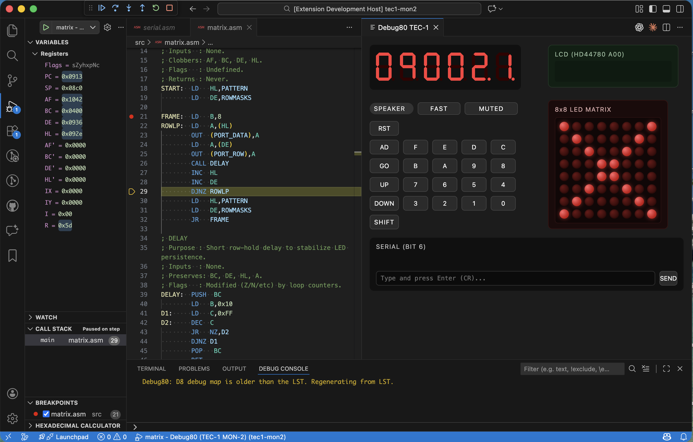

# Mature Project: The Great Unbundling

As Debug80 reached maturity, it faced a classic architectural crossroads. We started with a simple debugger and quickly added support for the TEC-1 platform. ROM loaders and example games like *Caverns* followed. The repository was becoming a "mono-blob" that cluttered the codebase with machine-specific binary data and logic. To ensure the long-term stability of the core debugger, I initiated what I called "The Great Unbundling."

This capture shows the interface state that framed the unbundling work.

## Identifying the Core

The core of Debug80 is the VS Code Debug Adapter Protocol (DAP) implementation plus the Z80 emulator. I treat everything beyond that as peripheral. That peripheral layer includes the TEC-1 ROMs and its RAM initialization files. Scalability meant that a developer should be able to use Debug80 for *any* Z80 project without the core repository needing to know about that project's specifics.

## The Role of debug80.json

The bridge between the generic core and the specific platform is the `debug80.json` configuration file. Instead of hardcoding platform memory details in the TypeScript source, I moved them into a declarative per-project configuration. This shift allowed the `debug80` repository to delete several hundred kilobytes of binary ROM data and machine-specific code.

## Decoupling the Ecosystem

With the core now generic, specific platforms can live in their own repositories. `debug80-tec1` contains the TEC-1 specific monitor code and configuration templates. `caverns80` owns its game logic and assembly organization. When a developer wants to debug a new machine, they don't need to submit a PR to the main Debug80 repo. They create a new repository and include `debug80` as a tool, along with their own `debug80.json`.
