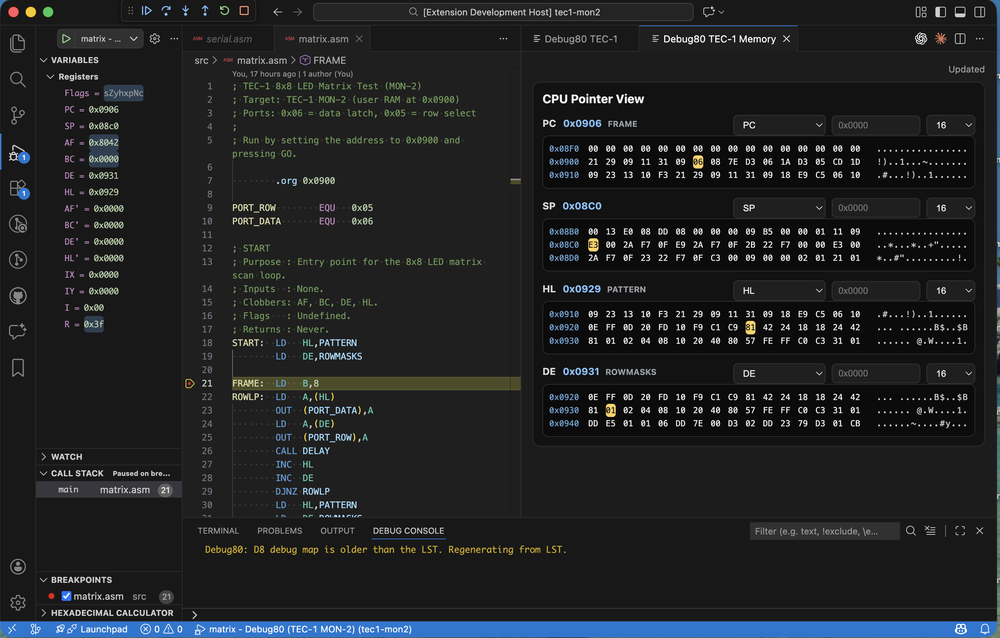

# The Memory Panel and the Snapshot Pipeline

I wanted a place where I could read the machine state directly. Registers are fine, but they do not show what the bytes around them look like. When I was stepping through programs I kept jumping between the listing and the hex view in my head. That is when I decided to build a dedicated memory panel for the TEC-1.

The first step was a new command, `debug80.openTec1Memory`. I built a webview that could sit beside the main TEC-1 panel. The adapter gained a custom request named `debug80/tec1MemorySnapshot`. It reads the current register set and chooses a centre address. It then returns a window of bytes around that address. The adapter aligns the window to the row size so the panel does not jitter as the pointer moves. A focus index marks the exact byte under the pointer, which lets the view highlight the address that triggered the snapshot.

The first version shipped with three views, with PC and SP fixed in place. The third view followed HL, with an optional absolute address override for quick jumps. The panel refreshes on a short timer so it stays in step during stepping and short runs. I did not want to force another button press every time I hit Step.

As soon as I started using it, the limits became obvious. A single view is not enough when the program counter and stack pointer move while a data pointer moves too. I rewired the snapshot payload to accept a list of views instead of a single view. Each view entry carries its own id and view mode. The window size is set per view. The adapter now produces a response that mirrors the list so the panel can update all views in one round trip.

That change made the panel a four-pane dashboard. PC and SP now sit beside HL and DE, each with its own window length. I kept the row size consistent and the alignment rules identical so the panes stay visually comparable. This is a small detail, but it matters when you are scanning two panes and trying to align addresses by eye.

The last piece was symbols, because I wanted to see where I was without opening the listing. The adapter now builds a symbol index when a session starts. If the mapping already has anchors, it uses them. If not, it parses the listing for lines like “DEFINED AT LINE”. It extracts the symbol name and address, then records the file for each line. I then sort those anchors and filter them against valid mapping ranges so I do not label bytes that fall outside the assembled segments.

The snapshot response now returns two symbol payloads. Each view includes the nearest symbol plus the offset from that symbol. The panel also receives the full symbol list, which it uses to add a symbols group to each view selector. When I choose a symbol, the panel resolves it to an absolute address and updates the view.

The memory panel started as a simple hex window, but it is now a surface that carries context. It is the closest tool I have to an always-on listing, and it makes the machine readable while the program is still in motion.
