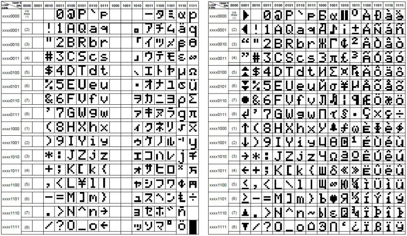

# Simulating the HD44780 LCD

By John Hardy

The HD44780 LCD controller shows up everywhere in hobby hardware. It is still the default character display for small Z80 builds, so Debug80 needed a faithful rendering path for it. I wanted the display to live in the platform view alongside the rest of the simulated hardware instead of becoming an external widget.

The simulation starts with a tiny device model. It tracks display memory and cursor position. It also tracks the mode bits that shape how the controller behaves. The runtime treats writes to the LCD as two channels. Command writes update state, starting with clear and home for the basics. Address mode changes update the cursor rules. Data writes insert characters into the buffer at the current cursor location. That split is enough to render meaningful output in the debugger even when the host code is low level and timing oriented.

The renderer stays intentionally simple because I want the display to mirror the device rather than invent a new UI. It converts the display buffer into a grid of glyphs and paints each cell using the LCD character ROM. I used the HD44780 character set image as a visual reference and a check against the pixel data that drives the render.
.

The result is a display panel that behaves like the hardware I expect. Characters appear in place as bytes arrive. The cursor advances in step with writes. Clear and home commands reset the visible state. It is not a full electrical simulation, but it is enough to make LCD-based programs readable inside the debugger. That is the level of fidelity I want in the platform view. It is practical and inspectable, and it stays close to the hardware.

The next step is to extend the model to handle custom glyphs and more display geometries. For now the base character ROM covers most of the software I want to run. It keeps the display faithful to what shows up on the bench. I will expand the model when I have real programs that depend on custom glyphs.
