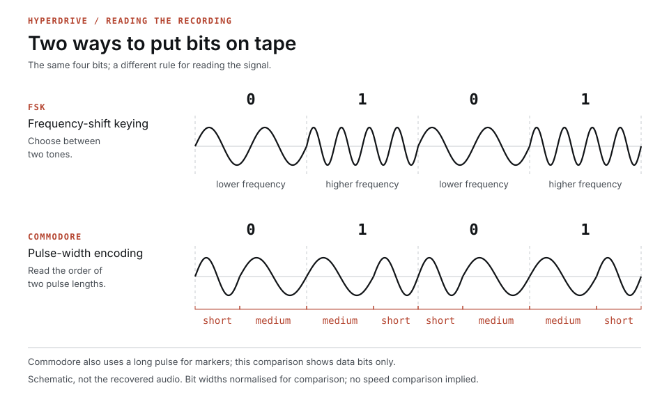

# Recovering Hyperdrive, part two: Pulse-width modulation

By John Hardy

<figure>
  
  <figcaption>Two ways to put bits on tape. Schematic waveforms, with bit durations normalised for comparison. This illustration is public domain.</figcaption>
</figure>

When Ken asked whether I could recover Hyperdrive, I would have settled for being able to read it. Nearly forty-five years had passed since he'd built his science-fiction adventure on the Caverns code we'd worked on together. In [part one](https://semantic-scroll.com/content/2026/09/09/01-recovering-hyperdrive-part-one-a-very-old-cassette/), I described how his cassette gave me a way to investigate work I could no longer reconstruct from memory. His recording contained a little over four minutes of sound. Somewhere in it were the descriptions, puzzles and instructions, in far more detail than I could remember. At first, an imperfect, all-uppercase transcription would have been enough.

A WAV file contains measurements of an audio waveform, including noise and distortion. I expected frequency-shift keying, or FSK, familiar from modems and many cassette systems: one tone for zero, another for one. Commodore surprised me by using pulse-width modulation. I needed to measure the lengths of pulses and interpret their sequence. That meant working out how Commodore had arranged them, then writing programs to extract the information.

Commodore used short and medium pulses in pairs: short–medium represented zero, and medium–short represented one. Both combinations took the same total time, and the VIC read them by measuring intervals with a timer. Each eight-bit byte needed sixteen pulses for its data. A third, long pulse marked boundaries: long–medium began a byte, while long–short ended a data block. These markers gave a decoder places to regain its position after a misreading.

The format also allowed for imperfect recordings. Before each block, a leader of short pulses established timing and accommodated differences in tape speed. A recognisable countdown followed it. Each byte included a parity bit, calculated from its data to help detect errors, with a checksum providing a further check across the block. Commodore recorded both the header and program twice, giving me repeated material to compare if one copy contained a dropout. These precautions cost tape and loading time, but they gave me structure to investigate.

I used a TAP file, the pulse-duration format used by Commodore emulation tools, to work on those timings without analysing the audio afresh on every attempt. The WAV contained sampled sound; the TAP contained timings extracted from it, including the leaders, markers and repeated blocks. My programs classified pulses, found byte boundaries and extracted bytes, which I then searched for recognisable text:

```text
KHYPERDRIVE
COPY RIGHT MICRO PARTS, 1982
DIST10
TI
000000"
```

There was the game's name, followed by Micro Parts, Ken's business, and the date. Room descriptions and prompts appeared elsewhere among fragments of instructions. After looking through so many numbers, I was finally reading words from the game. The stray K in `KHYPERDRIVE` came from a number immediately before the filename: its value happened to match the character code for K, so my extraction joined them together. I was finding words, but still needed the structure around them.

The tape header contained the filename and the program's start and end addresses in memory. Separating the program bytes from that surrounding information gave me a PRG: a two-byte loading address followed by the bytes to place in memory. A PRG can contain different kinds of program; this one contained BASIC in the form the VIC-20 stored it. Reading that as ordinary text mixed together characters and numbers with entirely different jobs.

BASIC was the language you typed directly into the VIC. You entered numbered instructions, then typed `RUN` to execute them. The computer saved a compact version: the five letters of `PRINT`, for example, became a one-byte token. This saved memory and let the interpreter select the appropriate routine directly. Each line also had its number and a pointer to the next line. To produce a readable listing, I had to interpret those records and expand the tokens. One early attempt opened like this:

```basic
156 H..
45604 "000000"
5 FU=0
```

With a recording this old, damage seemed an obvious explanation. Here, though, the extractor had started at line three's record and treated its pointer as the PRG's loading address, putting the subsequent fields in the wrong positions. Adjusting the starting point produced sensible BASIC from line four onwards. I could make progress by correcting how I read the bytes, before concluding that I had lost them. The opening still needed attention, especially the copyright notice I'd glimpsed among the fragments:

```basic
1 REM COPY RIGHT MICRO PARTS, 1982
2 REM DIST10
3 CLR
```

All three lines occur in both recorded copies. `REM` introduces a comment, which the interpreter skips; `CLR` clears variables. I wanted the notice exactly as he'd written it, including `COPY RIGHT` as two words. The business name, date and wording gave me something to check against what I remembered.

The notice dates from two years before Australia's [1984 copyright amendment](https://www.legislation.gov.au/C2004A02907/asmade) explicitly included computer programs as literary works. The earlier law could protect written source, while courts distinguished it from the machine-readable form in computer chips. Ken was already selling his game and asserting copyright while those distinctions remained unsettled.

The dots and strange symbols among the words still looked like damage. Looking into PETSCII, Commodore's character encoding, explained why my conversion was misleading. ASCII assigns numbers to letters, digits and punctuation; PETSCII overlaps enough of it for much of the text to look plausible, but also includes graphics and screen controls. I had to rediscover conventions that a VIC programmer in 1982 could use straight from the keyboard.

Even the alphabet depended on a setting. The default character set combined uppercase letters with graphics; an alternative provided upper- and lowercase letters with fewer symbols. The same value, 65, displayed as A in the first mode and a in the second, where 193 could display uppercase A. My conversion could turn a lowercase letter into a capital and discard the actual capital as an unrecognisable symbol. The original bytes contained information I'd assumed I might have to give up. Two attempts at the title line show the problem:

```basic
422 PRINT".........YPERDRIVE"
422 PRINT"       HYPERDRIVE"
```

Those nine dots covered a black-text control, five moves right, two moves down and an uppercase H. The title routine selected mixed-case mode, so the remaining letters would appear in lowercase: *Hyperdrive*. The second conversion recovered the H but replaced cursor movements with spaces and printed the word in capitals. It looked cleaner, yet still lost the positioning and letter case.

Commodore let you put screen operations inside quotation marks alongside text. Pressing a colour key inserted a control byte; printing the string changed the colour of subsequent letters. Cursor movements worked similarly. During a BASIC listing, these controls could appear as reversed symbols you could edit alongside the words. A single `PRINT` statement could position the title and set its colour. Decades later, I was replacing those instructions with dots. Even the value 144 depended on context: it meant the keyword `STOP` in an instruction, but selected black text inside an output string. Following quotation marks was as necessary as recognising the tokens.

Working through those roughly fourteen kilobytes, I could read the descriptions and trace the logic of a game I couldn't have recreated from memory. The title's letter case, position and colour were there too, encoded in bytes I'd initially mistaken for damage. I'd started out hoping to salvage some readable words; I now had the source of the game, with details of its writing and presentation that I'd forgotten over the intervening decades.
