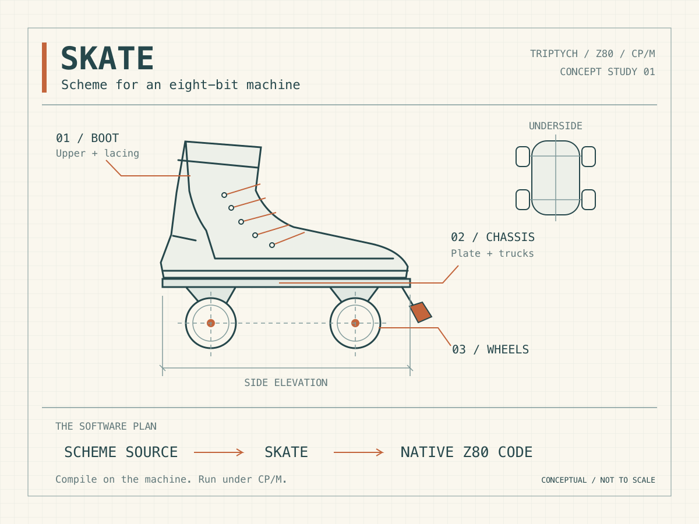
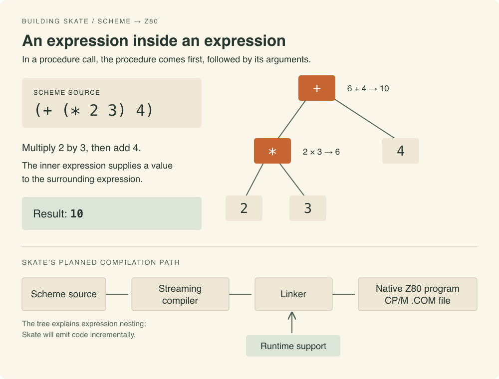

# Starting Skate

By John Hardy

<figure>
  <picture>
    <source srcset="./assets/skate-blueprint.svg" type="image/svg+xml">
    
  </picture>
  <figcaption>A plan for Skate. This illustration is public domain.</figcaption>
</figure>

I’ve decided to build a Scheme compiler for the Z80 running CP/M. I’m calling it Skate. It follows my work on the Triptych computer project and its software, including [ATOM](https://semantic-scroll.com/content/2026/09/04/01-atom-my-z80-assembler/), my Z80 assembler. Working with these small machines has become a way to study programming from first principles. Building a language adds another level to that work: we can follow an idea expressed in a program down to the instructions that carry it out.

Scheme appeals to me because a small set of concepts gives us considerable freedom in how we organise a program. A procedure can accept another procedure as an argument or return one as its result. We can put procedures into data structures alongside other values. That makes it possible to write a general calculation and supply the particular operation separately. Lists provide a simple way to assemble and process structured data. These are useful ways to think about programming even when the machine underneath operates on bytes and addresses.

The aim is a development tool that runs on the small machine itself. We should be able to edit Scheme source at the CP/M prompt and compile it into a native Z80 executable. Both the compiler and the programs it produces have to fit within a 64 KiB address space with some of that space occupied by CP/M. Preserving enough of Scheme to write useful programs within those limits is the central design problem.

In ATOM I use a streaming approach to process source in a small working area and write output progressively. Applying that approach to Skate gives us a way to compile source without keeping a complete representation of the program in memory.

<figure>
  <picture>
    <source srcset="./assets/lisp-to-z80.svg" type="image/svg+xml">
    
  </picture>
  <figcaption>Expression nesting and Skate’s planned compilation path. This illustration is public domain.</figcaption>
</figure>

The classic programming book *Structure and Interpretation of Computer Programs* supplies a practical standard for that ambition. Its examples give us programs worth implementing and reasons to examine the language features they use. The choices become easier to judge when we can see which algorithms remain straightforward to express and which compromises get in the way.

That connection between an expressive language and its implementation is the part I find most interesting. On a small machine we can account for the storage and follow the generated instructions in detail. A working compiler would give us a tool for writing CP/M programs as well as a way to understand how those language concepts become executable code.
