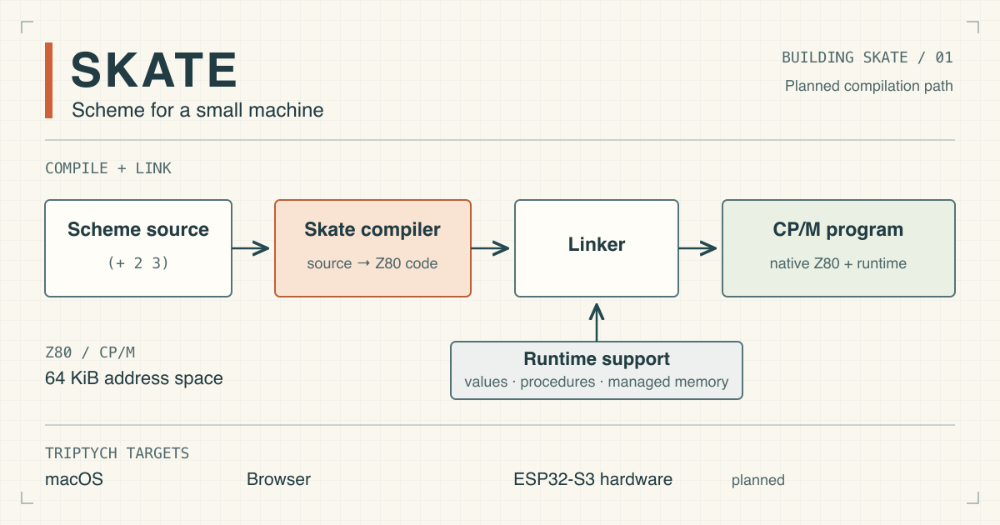

# A minimum viable Scheme

By John Hardy

<figure>
  <picture>
    <source srcset="./assets/skate-cpm.svg" type="image/svg+xml">
    
  </picture>
  <figcaption>Skate’s planned compilation path and Triptych targets. This illustration is public domain.</figcaption>
</figure>

I’ve decided to build a Scheme compiler for the Z80 as part of my Triptych computer project. I’m calling it Skate, which is a play on “Scheme” and “eight” (as in 8-bit systems). Triptych is an 8-bit system that runs CP/M, and my software work for it already includes ATOM, a Z80 assembler, and a few recovered adventure games I originally wrote in the early ’80s. Working with these machines again has become an education in building software from first principles, with small amounts of memory and basic hardware keeping the underlying operations within reach.

Skate extends that work into language design. The question is how much Scheme we can fit into this environment while keeping it useful for substantial programs. In other words, I’m searching for a minimum viable Scheme. That means working out which facilities to include, where a simpler implementation will do, and what limitations we’re prepared to accept. Through this series, we’ll follow those decisions from the language a programmer uses down to the instructions and storage that make it work.

Scheme is a member of the Lisp family, with a small core from which we can build quite sophisticated programs. Scheme calls its functions procedures, including those that return values. Procedures are themselves values, so we can pass one procedure to another as an argument. The classic programming book _Structure and Interpretation of Computer Programs_ describes this style of programming. Being able to run most of its example programs is a goal for Skate and a practical test of how much Scheme the implementation supports.

Those examples also give “viable” a more definite meaning. We can judge a language feature by the programs we can write with it, and check the consequences of simplifying it. If an example needs rewriting to run on Skate, we can examine what changed and whether the result still expresses the same algorithm clearly. That gives us a basis for judging the compromises, as well as a collection of programs to test as the implementation develops.

The Z80 has a 64 KiB address space, part of which CP/M occupies. Skate will be a compiler: it will translate Scheme source into native Z80 machine code before the program runs, rather than interpret the program during execution. The compiler must fit within the available memory; later, the compiled program and its runtime support must leave enough space for its data. I’ve already developed techniques for processing a stream of source code in a small working area, which my assembler ATOM uses. Applying that approach to Scheme gives us a starting point for keeping the compiler’s memory use down. The values used by the compiled programs will need their own storage arrangements.

In Scheme, procedures are values alongside numbers, text and other data. We can give a procedure a name, pass it as an argument, return it from another procedure or store it in a list. This is what it means for procedures to be “first-class”.

Skate’s basic values will include integers for counting and indexing, floating-point numbers for fractional calculations, and booleans for true and false. Symbols provide named data, while characters and strings provide text. With lists, we can assemble values into larger structures and write procedures to operate on them. This is enough to begin exploring useful algorithms, from numerical calculations to searching lists and processing text; each gives us a reason to examine how the corresponding values work on the machine.

For Skate to be a practical way to write CP/M programs, execution speed counts alongside memory use. Compiling directly to Z80 instructions should give us efficient execution, with the generated code linked to a runtime that supports dynamically allocated objects and automatically reclaims unused memory. The compiler and runtime together have to provide Scheme’s behaviour economically enough to leave room for useful amounts of program data.

We can approach the implementation one small program at a time. Even adding two numbers raises questions about how their values are stored and which instructions perform the addition. Once that is clear, a calculation repeated over a list adds a data structure to examine. Each step gives us something concrete to build on, so a reader with some programming experience should be able to follow the construction without needing a background in Scheme or compiler design.

I plan to release Skate’s source so readers can try the compiler and examine its implementation. Triptych’s CP/M environment runs on several platforms: it already works as a desktop application on macOS and in the browser. The browser version will be the easiest way to compile and run the examples. I’m also developing a hardware version based on ESP32-S3 microcontroller boards, where the same CP/M environment will run through Z80 emulation. Skate will provide a way to write programs for that machine too, so the work here will carry across from examples in a browser to software running on a physical Triptych system.

---

Discuss this article on [Mastodon](https://jorts.horse/@jhlagado/117292024470334414), [Bluesky](https://bsky.app/profile/did:plc:ryqselzoaiie6vwxh5gkra7i/post/3mvs67hrtno2l) or [X](https://x.com/14682998/status/2100925006536392717).
