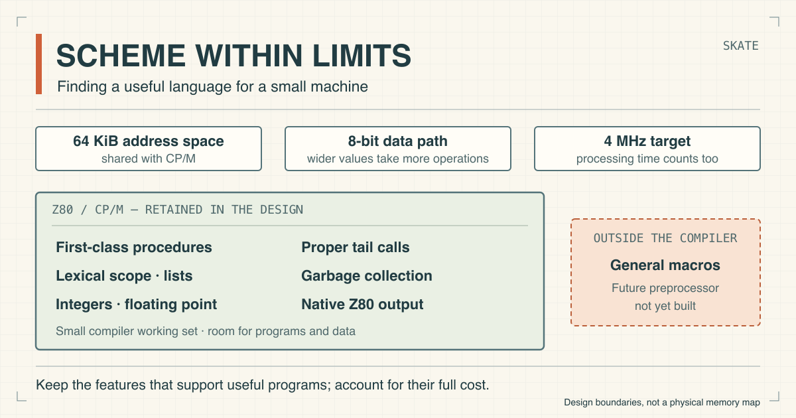

# Scheme within limits

By John Hardy

<figure>
  <picture>
    <source srcset="./assets/scheme-within-limits.svg" type="image/svg+xml">
    
  </picture>
  <figcaption>Skate’s language choices within the target machine’s limits. This illustration is public domain.</figcaption>
</figure>

In [the previous article](https://semantic-scroll.com/content/2026/09/18/01-a-minimum-viable-scheme/), I described Skate as a search for a minimum viable Scheme. The next question is what we need to keep for it to be worth programming in. On an 8-bit processor running at 4 MHz, with 64 KiB of address space shared with CP/M, each feature has a cost in memory and processing time.

First-class procedures, lexical scope and lists are central to the language I’m trying to preserve. They let us build procedures that accept other procedures, retain local state and operate on structured data. Proper tail calls allow recursive repetition without an ever-growing call stack, while garbage collection recovers storage as data falls out of use. These are the capabilities that make Scheme worth fitting onto the machine.

The compromises will come elsewhere: user-defined procedures will initially take a fixed number of arguments, and facilities such as continuations and runtime evaluations are outside the scope of the first version. General macros will also stay out of the compiler; a separate preprocessor could provide them later. That leaves a smaller implementation to understand and maintain, with less working storage needed during compilation.

Floating point numbers are staying in the design alongside integers. The floating point arithmetic routines are compact enough to justify keeping fractional calculations available. Reading and printing those numbers add to the cost, so the complete facility still needs measuring. The useful comparison is the cost of a feature against the programs it lets us write.

Streaming compilation will help keep the working set small, and native Z80 output should make efficient use of the processor. The aim is a practical tool for writing Scheme programs on CP/M, with enough capacity for substantial examples from _Structure and Interpretation of Computer Programs_. Building the compiler from simple mechanisms should also make it possible to follow the implementation from Scheme down to Z80 instructions. That is the educational appeal for me: understanding how the language works on a machine small enough to examine in detail.
