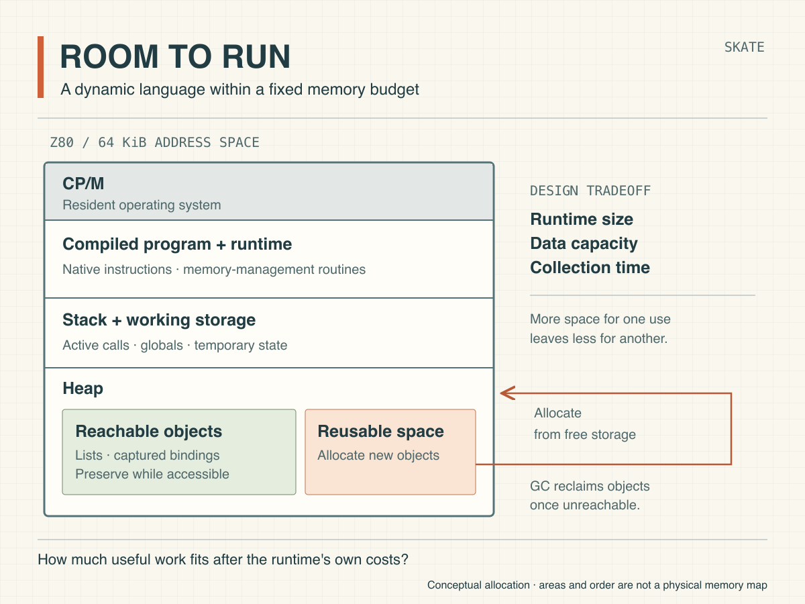

# Room to run

By John Hardy

<figure>
  <picture>
    <source srcset="./assets/room-to-run.svg" type="image/svg+xml">
    
  </picture>
  <figcaption>Budgeting memory for compiled Scheme and its runtime. This illustration is public domain.</figcaption>
</figure>

With Skate, my Scheme compiler for Z80/CP/M, I'm exploring how much of a dynamic language we can make practical on an eight-bit machine. In [Scheme within limits](https://semantic-scroll.com/content/2026/09/19/01-scheme-within-limits/), I outlined the features worth retaining in a minimum viable Scheme. Implementing them means solving a storage problem: how do we provide the freedom to create and retain data while leaving enough memory for a useful program?

For someone accustomed to C, a familiar starting point is the distinction between globals that last throughout execution and local variables whose storage lasts for a procedure call. In C, we can allocate longer-lived structures on the heap, but we must arrange when to free them. In Scheme, we can construct a list, return it from a procedure and pass it elsewhere without assigning responsibility for releasing each part. To support that style of programming, we implement automatic memory management in the runtime.

The same lifetime problem extends to procedures. We can write a procedure that establishes a local counter and returns another procedure that increments it. After the original call finishes, the returned procedure still has access to the counter. This combination of a procedure and its surrounding bindings is a *closure*. We therefore need to preserve the counter beyond the creating call, then recover its storage when no usable reference remains.

Lisp researchers developed [garbage collection](https://www-formal.stanford.edu/jmc/history/lisp/node3.html) to recover storage automatically, and that approach remains central to Scheme. Skate translates source into Z80 instructions and combines them with runtime support in a CP/M executable; the design includes allocation and collection among those runtime services. [Go provides a familiar comparison](https://go.dev/doc/faq#runtime), combining native compiled code with a memory-managing runtime. Compiling the program settles how to execute its operations; we still need runtime machinery to manage the objects it creates.

For the Z80 version, we have to fit the executable, runtime, stack and program data into the 64 KiB address space, after allowing for CP/M. Allocating more space to one use leaves less for the others. We also have to balance the storage used by the collector against the time it spends finding reclaimable objects. On a processor running at 4 MHz, a design that saves a little memory through repeated scanning can impose a noticeable delay.

The purpose of those tradeoffs is to make Scheme's expressive style practical on this machine. With closures and automatic memory management, we can organise programs around the relationships between their data and procedures, leaving much of the storage bookkeeping to the runtime. Fitting that support into a small system is an interesting engineering challenge in its own right. If we get the balance right, we'll have a practical way to write programs at that level of abstraction and run them as native code on an eight-bit computer. That's a worthwhile reason to build Skate.
