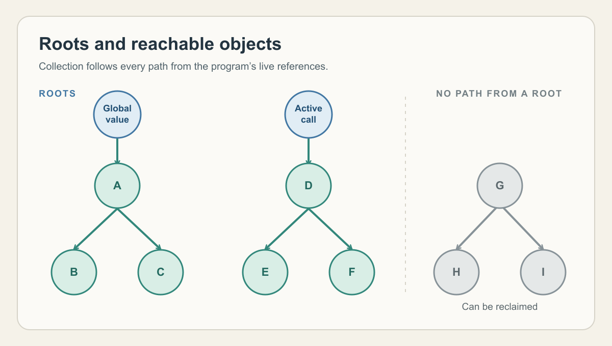

# Taking out the garbage

By John Hardy

<figure>
  <picture>
    <source srcset="./assets/hero-tree.svg" type="image/svg+xml">
    
  </picture>
  <figcaption>The coloured objects remain reachable. The grey objects can be reclaimed. This illustration is public domain.</figcaption>
</figure>

Scheme is an appealing language because it allows a programmer to focus on the algorithm, its procedures and the values that flow between them, rather than spelling it out chiefly as a sequence of changes to the underlying data storage. This style has its roots in lambda calculus and often feels closer to how we reason through a problem. Lists and other structures can take shape as the calculation proceeds and remain available for as long as the program can use them.

In a lower level language such as C, the programmer also has to arrange the lifetime of allocated data. As a structure passes between parts of a program, deciding when it is safe to free that data and reuse its space can become a substantial part of the work. Scheme moves that work into the runtime.

This trade-off becomes sharper in Skate, my attempt to make a useful Scheme for small Z80 systems. The compiled program, its runtime and its data all have to fit within a 64 KiB address space. Skate uses automatic memory management to recover storage for repeated work. The collector also competes for storage and processor time as it traces through the live data. On a small system, the challenge is to recover memory while keeping those overheads in proportion to the work the program does.

For example, a linked list consists of pairs, small two-slot records. One part of each pair holds an item and the other refers to the next pair. A reference to the first pair is enough to find the entire list by following those links. When the program can no longer reach a pair, it still occupies memory until it is recovered by the memory manager. Without that recovery, repeated work would eventually fill all of the available memory.

Roots are known places where the running program can hold references, for example global variables and live values in active procedure calls. The collector follows references from every root through the data structures they lead to. Objects can still refer to one another, but if no path from a root reaches them, they can be collected.

Skate's garbage collector uses a simple *mark-and-sweep* algorithm. This marks the objects it reaches from the roots, then sweeps through allocated memory and returns the unmarked objects to a free list. This allows the freed storage to be used again by the program.

I'm starting with the most straightforward approach I can with regard to memory management. Keeping the collector small enough to fit the machine enables me to experiment with ways to reduce collection time or improve memory use. I'll measure how each change affects memory use and collection time. As I run more Skate programs on small systems, I expect those results to show which refinements are worthwhile.
