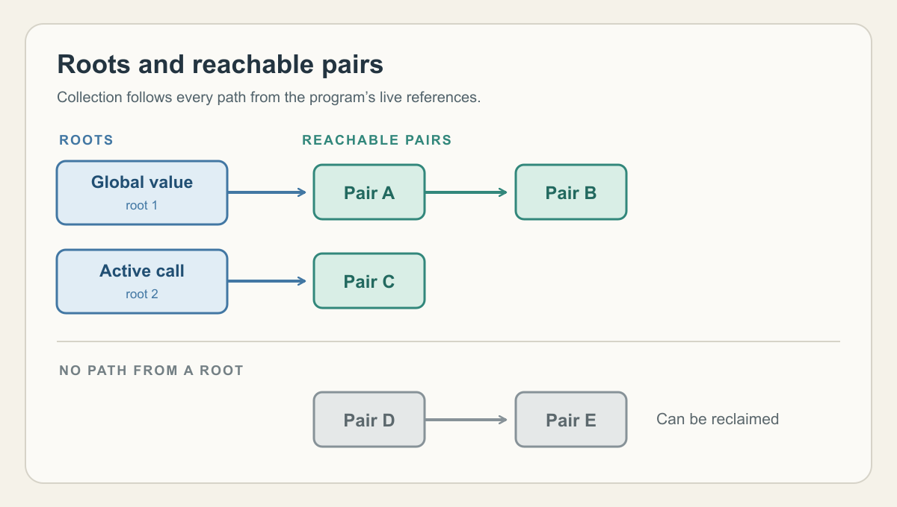

# Taking out the garbage

By John Hardy

<figure>
  <picture>
    <source srcset="./assets/hero.svg" type="image/svg+xml">
    
  </picture>
  <figcaption>The coloured pairs remain reachable. The grey pairs can be reclaimed. This illustration is public domain.</figcaption>
</figure>

Scheme is an appealing language because it allows a programmer to focus on an algorithm, the procedures that express it and the values flowing between them, rather than spelling it out chiefly as a sequence of changes to the underlying data storage. This style has its roots in lambda calculus and often feels closer to how we reason through a problem. Lists and other structures can take shape as the calculation proceeds and remain available for as long as the program can use them.

In a lower level language such as C, the programmer also has to arrange the lifetime of allocated data. As a structure passes between parts of a program, deciding when it is safe to free that data and reuse its space can become a substantial part of the work. Scheme moves that work into the runtime.

This trade becomes sharper in Skate, my attempt to make a useful Scheme for small Z80 systems. The compiled program, its runtime and its data all have to fit within a 64 KiB address space. Skate uses automatic memory management to recover storage for repeated work. The collector also uses memory and processor time as it traces live data. On a small system, the challenge is to recover memory while keeping those overheads in proportion to the work the program does.

For example, a linked list consists of pairs, small two-slot records. One part of each pair holds an item and the other refers to the next pair. A reference to the first pair is enough to find the entire list by following those links. When the program can no longer reach a pair, it still occupies memory until it is recovered by the memory manager. Without that recovery, repeated work would eventually fill all of the available memory.

The garbage collector starts with roots: known places where the running program can hold references, such as global variables and live values in active procedure calls. It follows references from every root through the data structures they lead to. Objects may still refer to one another after the program has lost access to them, but those links cannot keep them alive without a path from a root. Any allocated object the collector cannot reach is available for collection.

Skate's garbage collector uses a simple *mark-and-sweep* algorithm. It marks the objects it reaches from the roots, then sweeps through allocated objects and returns the unmarked ones to a free list. The program can then reuse that storage.

I'm starting with the most straightforward memory manager I can build, keeping the collector small enough to fit the machine and clear enough to check. That gives me a baseline for testing ways to reduce collection time or improve memory use. I'll need to measure what each change saves and what it costs. As I gain experience running Skate on small systems, I expect to refine the design from those measurements.
