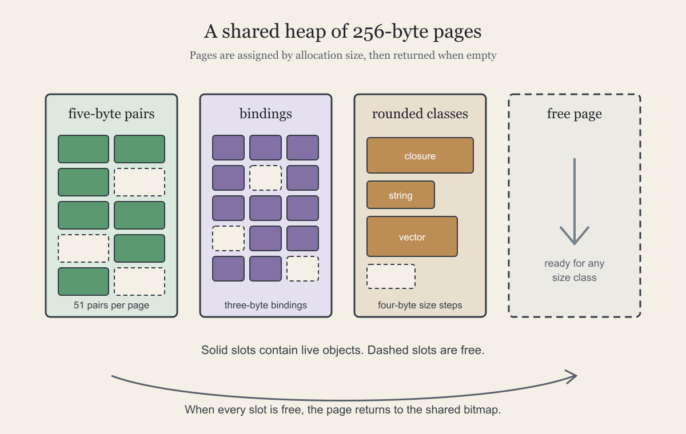

# Building a heap with slabs

By John Hardy

<figure>
  <picture>
    <source srcset="./assets/packing-the-heap.svg" type="image/svg+xml">
    
  </picture>
  <figcaption>Skate assigns 256-byte pages to different allocation sizes as the program runs. This illustration is public domain.</figcaption>
</figure>

Skate is my attempt to implement a useful Scheme programming language for Z80 systems running CP/M. In [Room to run](https://semantic-scroll.com/content/2026/09/20/01-room-to-run/), I described the memory constraints this places on the runtime. [Taking out the garbage](https://semantic-scroll.com/content/2026/09/22/01-taking-out-the-garbage/) then explained how Skate finds objects that a running program can no longer reach so their storage can be reclaimed and reused before the machine runs out of memory. The next problem is how to organise the storage itself.

During the development of Skate, it became apparent fairly quickly that I needed a memory allocator capable of handling several different object sizes. I had initially been thinking mainly about pairs, also known as cons cells. Scheme uses them to build linked lists and many other data structures. Each pair has two fields, traditionally called the *car* and the *cdr*. In Skate, both hold a two-byte payload. A fifth byte contains two three-bit type tags, along with the allocation and mark flags used by the memory manager. Either field can therefore hold any Scheme value.

I then realised that pairs were not the only kind of data structure Skate needed to store in its garbage-collected memory. A binding record holds the value associated with a variable in a two-byte payload and a byte of tags and flags, making it a three-byte object. A closure contains a procedure descriptor followed by a variable number of two-byte pointers to binding records.

Runtime strings and vectors add two more shapes that need to be managed. A runtime string contains a length followed by its characters while a vector is a mutable indexed collection that can contain different data types as elements. Both need storage determined by their contents rather than one fixed record size. For the allocator, the important facts are the amount of space requested and how the collector should trace the resulting object.

These objects vary in size but not without limit or pattern. Pairs and bindings have fixed sizes. The compiler knows the size of every closure and closures are rounded to the nearest convenient size. Strings and vectors carry bounded amounts of data. Most allocations are small and even the variable-sized objects fall into a predictable set of sizes.

Those requirements sent me looking for a suitable allocation algorithm. I eventually settled on a slab allocator. Skate divides the available heap into aligned 256-byte pages. A page assigned to five-byte objects can hold 51 pairs. Another can hold three-byte binding records while rounded size classes serve closures, strings and vectors. Every slot within a page shares the same size although the objects stored in them may have different tracing rules. The allocator keeps enough information outside the objects to interpret each live object.

The choice of 256 bytes per page is convenient on the Z80. In an aligned page, the high byte of an address identifies the page and the low byte gives the offset. A bitmap records which pages are free. When a size class needs more space, the allocator claims a page and links its free slots together. Larger objects can occupy consecutive pages but the complete run must be free before the allocator claims it.

A "Stop the World" mark-and-sweep collector, as described in the previous article, works across all of these memory layouts. The collector follows the fields in pairs, the values in bindings, the binding pointers in closures and the elements in vectors. A string contains no references so marking the string itself is enough. During the sweep, a page that still contains live objects remains assigned to its existing size class. The allocator rebuilds its free chain from the empty slots left on that page. If every slot in a page becomes free, the whole page returns to the shared pool and can later serve an object of a completely different size.

Slab allocation is a simple model and it does not eliminate wasted space. A page can retain unused slots while a single live object keeps it assigned to one size class. A large allocation may also fail when free pages exist but are not consecutive. These are forms of fragmentation and they matter on a small machine. The allocator has performed well enough in Skate's tests so far while keeping the implementation small and understandable.

For me, that is a reasonable place to start. I want the simplest memory manager that lets useful Scheme programs run within the limits of a Z80 system running CP/M. As Skate runs larger programs the measurements will show where space is being lost and whether added complexity is justified.
