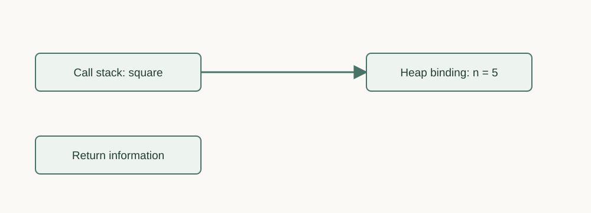
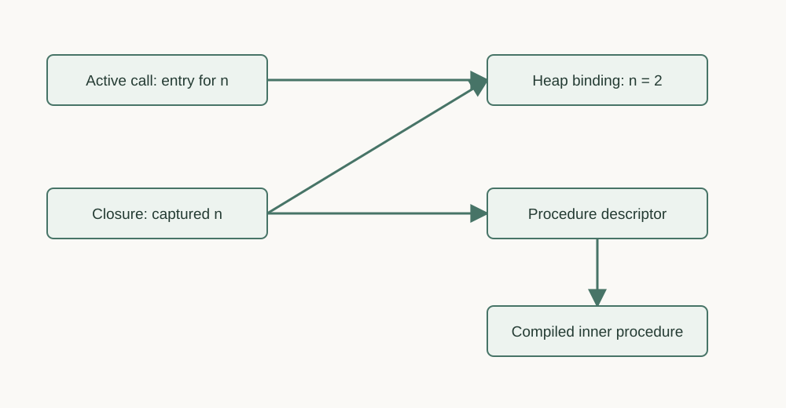
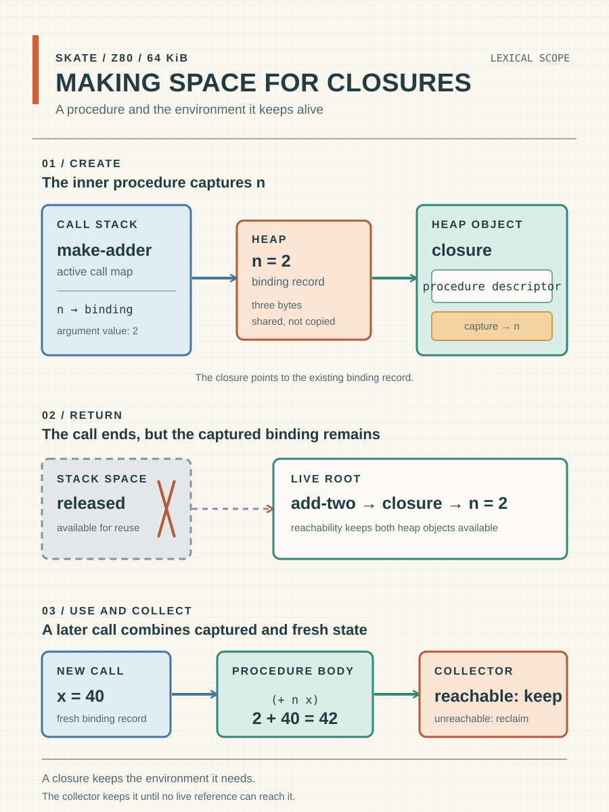
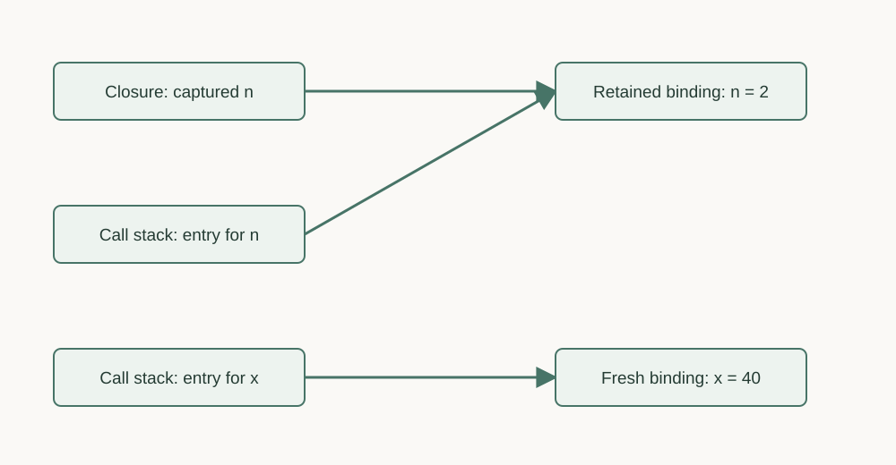

# Making space for closures

By John Hardy

Skate is my attempt to build a useful small Scheme for Z80 systems. In my article [Building a heap out of slabs](https://semantic-scroll.com/content/2026/09/25/01-packing-the-heap/) I described the storage used by Scheme data objects such as pairs, bindings and closures. Closures deserve a closer look because implementing them changes the way we arrange the lifetime of a procedure's local variables.

Procedures (i.e. functions) are central to Scheme. They take arguments, perform calculations and return a value. They are also values themselves, so we can store them in variables, pass them as arguments and return them from other procedures. Combined with lexical scope, this means a procedure can continue to use a local binding long after the call that created that binding has finished.

## An ordinary call

A small procedure gives us a starting point:

```scheme
(define (square n)
  (* n n))

(square 5) ; 25
(square 4) ; 16
```

In the first call the parameter `n` is bound to the argument `5`. The body multiplies that value by itself and returns `25`. The second call has its own binding for `n` with the value `4`. The parameter's name is the same in the source but each call supplies a separate value.

At the machine level we need somewhere to store the argument and enough information to resume the caller after the procedure finishes. The stack holds information about active calls. Returning from a call releases its stack space for reuse.

Skate separates that temporary call information from the storage for bindings. An ordinary call creates a map on the stack containing pointers to binding records on the heap. A binding record contains a value and its type and state flags. Each binding record occupies three bytes in the current implementation. Reading a variable means following its entry in the map to the corresponding binding record.



*The call's stack map refers to a separate heap binding. This illustration is public domain.*

When `square` returns, its map is removed from the stack. In this example nothing else refers to the binding for `n`, so the record becomes eligible for garbage collection. Its storage is reclaimed during collection rather than at the instant the procedure returns.

## Lexical scope

Scope determines which binding a name refers to. In Scheme this follows the nesting of the source code itself. A name refers to the binding in the nearest enclosing scope that defines it. An inner procedure can also refer to bindings established by the surrounding code.

```scheme
(define (make-adder n)
  (lambda (x)
    (+ n x)))

(define add-two (make-adder 2))
(add-two 40) ; 42
```

In this example `lambda` creates a procedure with one parameter, `x`. Its body uses both `x` and the surrounding parameter `n`. Calling `make-adder` with `2` creates that inner procedure and returns it to the caller. We bind the returned value to `add-two` and later call it with `40`.

By then the call to `make-adder` has finished. When we call `add-two`, its reference to `n` still uses the binding created by the earlier call to `make-adder`.

There are two separate ideas here: scope determines which binding an expression refers to while lifetime determines how long its storage must remain available. A procedure can return while a closure still uses one of its local bindings.

## Creating the closure

A closure is a special kind of procedure that combines its code with bindings from the surrounding environment in which it was created. Those bindings remain available whenever the closure is called, even after the enclosing procedure has returned. Evaluating the inner `lambda` creates this closure.

During the call to `make-adder`, Skate allocates a closure object on the heap. The object contains a pointer to the procedure descriptor followed by an array of pointers to the binding records. The descriptor identifies the compiled procedure and records information about its parameters and environment slots, including which slots are captures from an enclosing environment.

The captured entry for `n` points to the existing binding record. The value is not transferred out of the record or copied into a new private binding. For a while both the active call and the new closure refer to the same binding record.



*Before the outer call returns, its map and the new closure refer to the same binding. Only the relevant entries are shown. This illustration is public domain.*

When `make-adder` returns, its stack space is released. The returned closure remains accessible through `add-two` and still points to the binding record for `n`, so that record remains allocated.



*After make-adder returns, the closure retains access to n. The earlier call frame is gone. This illustration is public domain.*

## Calling the returned procedure

Calling `add-two` with `40` creates a new binding record for `x` containing that value. The call's stack map points to this new binding and to the captured binding for `n`. The procedure body uses these two bindings to add `2` and `40`.



*The invocation combines a captured binding with its own argument binding. This illustration is public domain.*

The result is `42`. When that call returns, its binding for `x` can become unreachable. The binding for `n` remains accessible through `add-two`, ready for the next call with a different argument.

We can also create another adder:

```scheme
(define add-ten (make-adder 10))
(add-ten 40) ; 50
(add-two 40) ; 42
```

Both closures use the same compiled inner procedure but refer to different bindings for `n`. We do not need another copy of the machine code for every adder.

Closures can also change captured variables. When two closures share a binding record, a change made by one is available to the other because both refer to the same stored value.

## Keeping the bindings alive

The collector described in [Taking out the garbage](https://semantic-scroll.com/content/2026/09/22/01-taking-out-the-garbage/) follows references from the running program's roots. It reaches binding records through active calls and closures. For each closure, the procedure descriptor identifies which binding pointers to follow.

As long as `add-two` remains reachable, its closure and the captured binding for `n` are not garbage collected. If the program loses its last reference to that closure, it becomes eligible for collection. The captured binding can also be reclaimed if no other live call or closure still refers to it.

On a Z80 all of this has a cost. Setting up a procedure call requires stack space and the allocation of binding records. Creating a closure allocates more heap storage and can extend the lifetime of its captured bindings. The garbage collector then spends processor time tracing references and recovering storage for reuse. All of this machinery has to fit alongside the program and its data within a 64 KiB address space!

There is a balance to strike. Collecting more often can recover unused storage sooner but takes time away from running the program. Allowing more allocation between collections means fewer interruptions but leaves less free memory available in the meantime. Collection also cannot recover bindings that a reachable closure is still using. A program that keeps creating and retaining closures can eventually exhaust the heap.

My tests so far have been encouraging and Skate has performed well enough with the programs I've tried. Even so, this is a substantial amount of support machinery to implement on a small machine. The challenge is to keep procedure calls, closure creation and garbage collection efficient enough that useful programs have room to run at a reasonable speed. For me, closures are part of what makes Scheme worth implementing so their cost is something that I need to manage carefully as I develop Skate.
