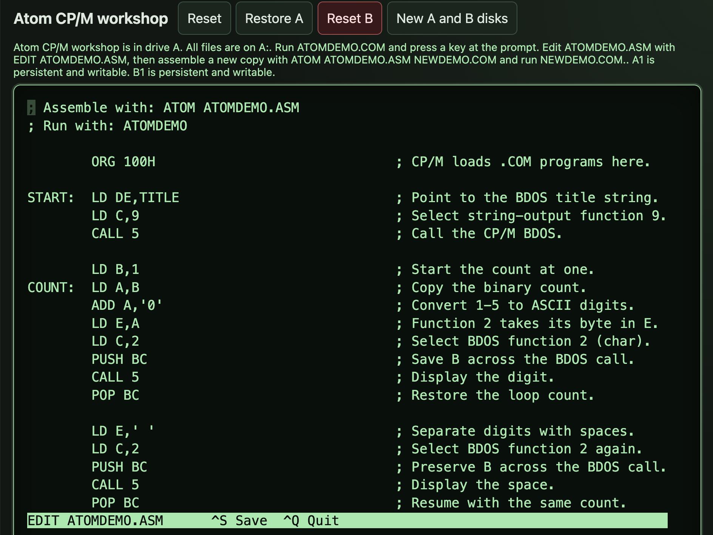

# Atom 0.3.5 for CP/M

By John Hardy

<figure>
  
  <figcaption>Editing ATOMDEMO.ASM in Triptych’s CP/M machine.</figcaption>
</figure>

When I [introduced Atom](https://semantic-scroll.com/content/2026/09/04/01-atom-my-z80-assembler/), my Z80 assembler, I said it runs on modern computers and under CP/M. With [Atom 0.3.5](https://github.com/jhlagado/atom/releases/tag/v0.3.5) the CP/M version is ready for other people to use. Put `ATOM.COM` and a text editor on a disk and you can write a Z80 program, assemble it and run it on the machine itself.

The quickest way to try it is to [open the Atom disk in Triptych](https://jhlagado.github.io/triptych/?workspace=https%3A%2F%2Fjhlagado.github.io%2Fcpm-recipes%2Frecipes%2Fatom-starter.json&components=atom%2Cedit%2Cdemo), a browser version of my Triptych computer. It starts CP/M with everything on drive A: the assembler, `EDIT.COM`, a commented source file called `ATOMDEMO.ASM` and the program assembled from it. Typing the program’s name runs it:

```text
A>ATOMDEMO
```

It prints a heading, counts from one to five and waits for a key before returning to the prompt. The comments in the source explain the loop and the CP/M calls it uses to print text and read the keyboard.

To make a change, open the source in Edit, the editor shown above:

```text
A>EDIT ATOMDEMO.ASM
```

Ctrl+S saves the file and Ctrl+Q leaves the editor. Giving the new program its own name keeps the original `ATOMDEMO.COM` as it was. These two commands assemble your version and run it:

```text
A>ATOM ATOMDEMO.ASM NEWDEMO.COM
A>NEWDEMO
```

If the source contains a mistake, Atom reports the file, line and column and leaves any earlier output file in place. It accepts standard Zilog mnemonics for the complete Z80 instruction set and can write COM, BIN or Intel HEX files. A program can also pull in other source files with `%INCLUDE` and binary data such as a font with `INCBIN`.

To run Atom on your own machine, download `ATOM.COM` from the [Atom download page](https://jhlagado.github.io/atom/) and copy it to a CP/M disk. It needs CP/M 2.2 with the BDOS at E400h or higher. Atom checks this as it starts and stops with “Insufficient transient memory” when there isn’t enough room. It reads and writes files on the current drive.

The demo disk comes from a small [Triptych recipe](https://jhlagado.github.io/cpm-recipes/recipes/atom-starter.json) that lists each file and where to download it. You can use it as a starting point for putting together a Triptych disk of your own.

The [Atom documentation at Debug80](https://debug80.com/atom/) includes separate guides for CP/M and Node, covering installation, commands and outputs for each version.

[Book 1, the assembler reference](https://debug80.com/atom-book/book1/), covers source syntax, symbols, expressions and directives. It’s the place to look up how to define a label, write an expression or control the layout of a program.

[Book 2, Z80 programming](https://debug80.com/atom-book/book2/), is for learning to write the programs themselves. The examples range from small loops and subroutines to arithmetic, sorting, strings and recursion, with Atom as the assembler throughout.

I set out to make [Triptych](https://semantic-scroll.com/content/2026/09/06/01-triptych/) a 1980s-style computer you can develop software on directly. With Atom and Edit running under CP/M, you can write the source, assemble it and test the result on that same machine.
